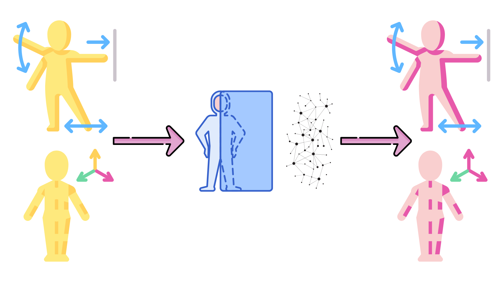

# Motion Tokenizer Training & Evaluation Pipeline

A comprehensive repository for training and evaluating various motion tokenization methods on human motion datasets.



## Overview

This repository implements and compares multiple motion tokenization approaches:
- **VQ-VAE**: Vector Quantized Variational Autoencoder (single layer)
- **Residual VQ-VAE (RQ-VAE)**: Multi-layer residual quantization 
- **VAE**: Variational Autoencoder
- **AE**: Standard Autoencoder

## Supported Datasets

- **HumanML3D** (primary)
- **Motion-X** 
- **HuMo100M**

## Quick Start

### Installation
```bash
git clone https://github.com/your-org/motion-tokenizer.git
cd motion-tokenizer
pip install -r requirements.txt
```

## Benchmark Results

### HumanML3D Dataset

| Model | Code Size | FID ↓ | MPJPE ↓ |
|-------|-----------|-------|---------|
| VQ-VAE₁ | 1024 | 0.183 | 47.54 |
| RQ-VAE₆ | 1024 | 0.032 | 23.58 |
| **RQ-VAE₈** | 1024 | **0.009** | **20.42** |
| PRQ₄ | 1024 | 0.007 | 14.06 |
| PRQ₆ | 1024 | **0.004** | **13.56** |

## Repository Structure

```
motion-tokenizer/
├── AE (MotionCM V2)/
├── VAE (MotionCM V2)/
├── VQ-VAE (single layer from MMM)/
├── Residual VQ-VAE (MoMask, BAMM, DanceMosaic)/
```

## Key Features

- **Multi-layer RQ-VAE**: Extends MoMask's 6-layer approach to 8 layers
- **Comprehensive Evaluation**: FID and MPJPE metrics
- **Modular Design**: Easy to add new tokenization methods
- **HumanML3D Focus**: Optimized for human motion representation

## Evaluation Metrics

- **FID (Fréchet Inception Distance)**: Measures distribution similarity
- **MPJPE (Mean Per Joint Position Error)**: Joint-level reconstruction accuracy

## Contributing

1. Fork the repository
2. Create feature branch (`git checkout -b feature/new-tokenizer`)
3. Implement your tokenizer in `models/`
4. Add evaluation in `evaluation/`
5. Update benchmarks and submit PR

## References

- BAMM : Biodirectional Autoregressive Motion Model
- MoMask: Multi-Modal Masked Modeling for Motion Generation
- MotionLCM: Real-time Controllable Motion Generation
- HumanML3D: 3D Human Motion-Language Dataset

---

*For questions or issues, please open a GitHub issue.*
